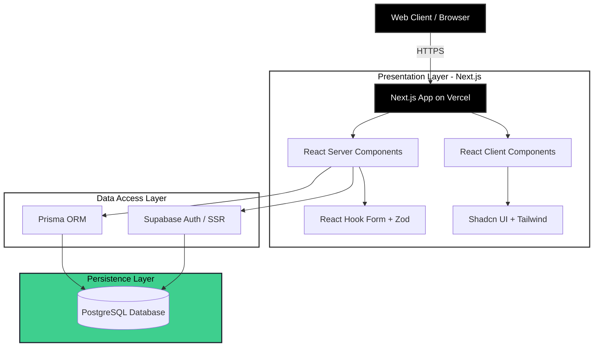

<div align="center">
  
  <h1>DevTrack</h1>
  <p><strong>A Modern, High-Performance Developer Progress Tracking Dashboard</strong></p>
  
  <p>
    
    
    
    
    
    
  </p>
</div>

---

## ⚡ Overview

**DevTrack** is an enterprise-grade web application built to help developers track their daily coding activities, monitor consistency, and visualize learning progress. Designed with premium aesthetics, it emphasizes data privacy, blazing-fast performance, and a sleek user experience via server-side rendering and edge computing.

## 🏗 System Architecture

The application adopts a modern, highly decoupled architecture using the **Serverless/Edge** compute model.



## ✨ Features

- 🏎️ **Next-Gen Performance**: Leveraging Next.js 16 and React 19 Server Components for instant load times and optimal SEO.
- 🎨 **Premium Aesthetics**: Masterfully crafted UI utilizing **Tailwind CSS v4**, **Shadcn UI**, and Framer Motion for buttery-smooth micro-animations.
- 🔐 **Robust Authentication**: Seamless and secure server-side auth integration powered by **Supabase**.
- 🗄️ **Type-Safe Database Access**: Schema-first ORM integration with **Prisma** paired natively with a PostgreSQL instance.
- 📊 **Interactive Data Visualizations**: Beautiful, responsive progress tracking charts powered by **Recharts**.
- 🛡️ **Ironclad Type Safety**: End-to-end type safety from the database to the DOM using TypeScript and **Zod** schema validation.
- 🚥 **Automated E2E Testing**: Comprehensive browser automation and regression testing using **Playwright**.

## 🛠 Tech Stack

| Category | Technology | Description |
| :--- | :--- | :--- |
| **Framework** | Next.js (App Router) | React framework for production |
| **UI Library** | React 19 | Component-based UI rendering |
| **Styling** | Tailwind CSS 4.0 | Utility-first CSS framework |
| **Components** | Shadcn UI, Radix PR | Accessible, unstyled UI primitives |
| **Database** | PostgreSQL | Relational database |
| **ORM** | Prisma 7.5 | Next-generation Node.js and TypeScript ORM |
| **Backend/Auth**| Supabase SSR | Open source Firebase alternative |
| **Forms** | React Hook Form & Zod | Form state management and schema validation |
| **Visuals** | Recharts, Lucide | Charts and SVG icon assets |
| **Testing** | Playwright | End-to-end robust UI testing |

## 🚀 Getting Started

### Prerequisites

- [Node.js](https://nodejs.org/) (v20+ recommended)
- [npm](https://www.npmjs.com/) or [yarn](https://yarnpkg.com/)
- A [Supabase](https://supabase.com) account & PostgreSQL connection URI

### Installation & Setup

1. **Clone & Install Dependencies**
   ```bash
   npm install
   ```

2. **Environment Variables Configuration**
   Duplicate `.env.example` and rename to `.env`. Configure your actual database strings:
   ```bash
   cp .env.example .env
   ```

3. **Database Initialization**
   Generate the Prisma client and push your schema to the remote database:
   ```bash
   npx prisma generate
   npx prisma migrate dev
   ```

4. **Launch Development Server**
   ```bash
   npm run dev
   ```
   *The application will boot on [http://localhost:3000](http://localhost:3000).*

## 🎨 Design Guidelines

Maintaining consistency is critical for our UI/UX:

- **Strictly Semantic Dark Mode**: DO NOT use `dark:` Tailwind prefixes inline. All colors are defined as variables in `globals.css` that transition based on the `.dark` class on the `<html>` element.
- **Anti-FOUC Strategies**: We utilize blocking inline scripts in `app/layout.tsx` to detect theme preference pre-paint.
- **Charts Compatibility**: Always use explicit HEX-based CSS variables for SVG elements (Grid: `var(--chart-grid)`, Muted: `var(--chart-muted)`, Primary: `var(--primary)`).
- **Accessibility FIRST**: 
  - Provide unique `id` and `aria-label` tags on all interactive elements.
  - Rely on semantic HTML landmarks (`main`, `nav`, `section`).
  - Maintain a minimum **44x44px** touch target for mobile-exclusive controls.

## 🧪 Testing

We employ **Playwright** for robust End-to-End (E2E) testing.

```bash
# Run tests in headless mode
npm run test

# Run tests with the Playwright UI
npm run test:ui

# View test report after run
npm run test:report
```

## 🌐 Deployment

This application is highly optimized for deployment on [Vercel](https://vercel.com/new).

To ensure a successful build:
```bash
npm run build 
# This runs \`npm run type-check && next build\`
```
*Note: Ensure your Production Environment Variables on Vercel reflect your actual production Supabase / Postgres URIs.*
