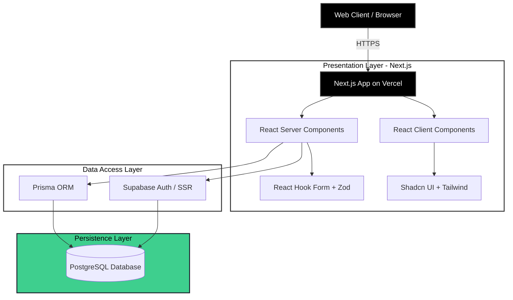

<div align="center">
  <h1>DevTrack</h1>
  <p><strong>A developer progress tracker: daily logs, DSA practice, side projects — with per-user data isolation enforced in the database.</strong></p>

  <p>
    <a href="https://daily-dev-track.vercel.app"><strong>Live app →</strong></a>
  </p>

  <p>
    
    
    
    
    
    
  </p>
</div>

---

## What this is

Log what you did today, what DSA problems you solved and which patterns they used, and what your side projects are up to. DevTrack turns that into streaks, pattern strengths/weaknesses, a developer score, and a handful of recommendations.

It is a single-developer product, so the interesting engineering is not the CRUD — it's that **one person's rows must never be reachable by another person**, and that this is enforced by Postgres row-level security rather than by remembering to write `where userId = …` in every query. See [Row-level security](#-row-level-security) for the policies and the test that proves they deny.

## 🏗 Architecture


```mermaid
graph TD
    Client[Web Client / Browser] -->|HTTPS| Vercel[Next.js App on Vercel]

    subgraph Frontend [Presentation Layer - Next.js]
        Vercel --> ServerComponents[React Server Components]
        Vercel --> ClientComponents[React Client Components]
        ServerComponents --> Forms[React Hook Form + Zod]
        ClientComponents --> UI[Shadcn UI + Tailwind]
    end

    subgraph Backend [Data Access Layer]
        ServerComponents --> Prisma[Prisma ORM]
        ServerComponents --> SupabaseAuth[Supabase Auth / SSR]
    end

    subgraph Database [Persistence Layer]
        Prisma --> PostgreSQL[(PostgreSQL Database)]
        SupabaseAuth --> PostgreSQL
    end

    classDef primary fill:#000,stroke:#333,stroke-width:2px,color:#fff;
    classDef secondary fill:#fff,stroke:#333,stroke-width:2px,color:#000;
    classDef db fill:#3ECF8E,stroke:#1A202C,stroke-width:2px,color:#000;

    class Client,Vercel primary;
    class Frontend,Backend secondary;
    class Database db;
```

Everything runs on the Node.js runtime on Vercel (server components + route handlers); nothing runs on the edge runtime. Auth is Supabase; the app talks to the same Postgres through Prisma with the `pg` adapter.

## ✨ Features

- **Daily logs** — one entry per day per user (enforced by a unique index), with topics and notes.
- **DSA tracking** — problems by difficulty, platform, and pattern; strongest/weakest pattern analysis.
- **Projects & milestones** — progress recalculated from completed milestones, with an activity-log audit trail.
- **Streaks** — current and longest, computed UTC-safe so a timezone change can't invent or break a streak.
- **Developer score & recommendations** — sub-scores with caps and weights; a small rule engine that surfaces at most 3 suggestions.
- **Per-user isolation** — RLS policies on all 8 user-owned tables (see below).
- **Realtime** — daily-log inserts/updates/deletes sync across tabs via Supabase Realtime.
- **Type safety** — TypeScript strict with no `any` in app code; Zod validation on every server action and route handler.

## 🛠 Tech Stack

| Category         | Technology              | Description                                 |
| :--------------- | :---------------------- | :------------------------------------------ |
| **Framework**    | Next.js 16 (App Router) | React framework for production              |
| **UI Library**   | React 19                | Component-based UI rendering                |
| **Styling**      | Tailwind CSS 4.0        | Utility-first CSS framework                 |
| **Components**   | Shadcn UI, Radix        | Accessible, unstyled UI primitives          |
| **Database**     | PostgreSQL (Supabase)   | Relational database                         |
| **ORM**          | Prisma 7.5              | TypeScript ORM (`@prisma/adapter-pg`)       |
| **Backend/Auth** | Supabase SSR            | Auth + Realtime                             |
| **Forms**        | React Hook Form & Zod   | Form state management and schema validation |
| **Visuals**      | Recharts, Lucide        | Charts and SVG icon assets                  |
| **Testing**      | Vitest + Playwright     | Unit tests and end-to-end browser tests     |

## 🚀 Getting Started

### Prerequisites

- Node.js v20+ and npm
- A [Supabase](https://supabase.com) project (auth) — its Postgres doubles as the database
- For the RLS test only: a local `psql` client and a throwaway local Postgres

### Installation & Setup

1. **Clone & install** (`postinstall` runs `prisma generate`, which needs no env vars)

   ```bash
   npm install
   ```

2. **Environment variables**

   ```bash
   cp .env.example .env.local   # app reads .env.local
   cp .env.example .env         # Prisma CLI reads .env
   ```

   Fill in `NEXT_PUBLIC_SUPABASE_URL`, `NEXT_PUBLIC_SUPABASE_ANON_KEY`, and `DATABASE_URL`. Use the **session-mode** connection string (port 5432) — the pooled pgbouncer URL (6543) makes the Prisma `pg` adapter hang on DDL.

3. **Create the schema**

   ```bash
   npx prisma db push        # or: npx prisma migrate dev
   ```

   `prisma.config.ts` (repo root) feeds the CLI its datasource URL from `DIRECT_URL` ?? `DATABASE_URL`.

4. **Apply the row-level-security policies** — these are _not_ applied by `prisma db push`:

   ```bash
   psql "$DIRECT_URL" -f prisma/migrations/001_enable_rls.sql
   ```

   (or paste the file into the Supabase SQL editor)

5. **Run it**

   ```bash
   npm run dev     # http://localhost:3000
   ```

Note: `npm run build` and `npm run dev` both need `DATABASE_URL` — page-data collection instantiates the Prisma client, and without it the build fails with `Error: DATABASE_URL is not defined`.

## 🔐 Row-level security

`prisma/migrations/001_enable_rls.sql` enables RLS and adds an owner policy on all 8 user-owned tables — `User`, `DailyLog`, `DSAProblem`, `Project`, `Milestone`, `ProjectActivityLog`, `Session`, and `SessionEvent` (gated through its parent `Session`, since it has no `userId` of its own). The rule is `auth.uid()::text = "userId"`.

What this does and does not cover:

- It **is** the defence for anything that reaches Postgres as the `authenticated`/`anon` role — Supabase Realtime and any direct PostgREST access.
- It is **not** what isolates the app's own reads: Prisma connects as the table owner, which bypasses RLS. Server-side isolation comes from the `userId` filter in `lib/services/*`. RLS is the backstop for the paths that don't go through those services.

Prove it rather than trusting it. Against a throwaway local Postgres:

```bash
createdb devtrack_rls
DIRECT_URL=postgresql://localhost:5432/devtrack_rls npx prisma db push
RLS_TEST_DATABASE_URL=postgresql://localhost:5432/devtrack_rls npm run test:rls
```

`prisma/rls/verify-rls.sql` stands up the pieces of Supabase the policies depend on (`auth.uid()`, the `authenticated`/`anon` roles), applies the real policy file, seeds two users, then asserts as user A that **every** cross-user read, update, delete, and forged insert is denied — and that an anonymous client sees nothing. Any leak raises and exits non-zero. The whole run is one transaction that rolls back, and the script refuses to run against a Supabase database.

## 🧪 Testing

**Unit tests** (Vitest, no database or network needed) — this is what CI runs on every push and PR, together with `type-check` and `lint`:

```bash
npm run test:unit          # 37 tests: date utils, streaks, scoring, recommendations
```

**RLS test** (local Postgres + psql) — see above:

```bash
npm run test:rls
```

**End-to-end** (Playwright, 75 specs × 3 browsers = 226 tests). These are _not_ offline tests: they drive a real browser against a running dev server and sign in against a real Supabase project.

```bash
npx playwright install     # once — downloads the browsers
npm run test               # headless
npm run test:ui            # Playwright UI
npm run test:report        # open the last HTML report
```

Requirements, all of which must be in `.env.local` before the suite can pass:

- `NEXT_PUBLIC_SUPABASE_URL` / `NEXT_PUBLIC_SUPABASE_ANON_KEY` — a reachable Supabase project
- `SUPABASE_SERVICE_ROLE_KEY` — `e2e/global-setup.ts` uses it to delete stale `devtrack.e2e.*@gmail.com` users and pre-create a confirmed test user
- `DATABASE_URL` — the dev server Playwright starts needs it

Without those, `e2e/auth.setup.ts` fails on `page.waitForURL(/.*dashboard.*/)` and every dependent test reports `did not run`. Known gaps are tracked in [`e2e/TEST_COVERAGE_GAP.md`](e2e/TEST_COVERAGE_GAP.md).

## 🎨 Design Guidelines

- **Semantic dark mode only**: no `dark:` Tailwind prefixes inline. Colors are CSS variables in `globals.css` that switch on the `.dark` class on `<html>`.
- **Anti-FOUC**: a blocking inline script in `app/layout.tsx` resolves the theme pre-paint.
- **Charts**: use the explicit CSS variables for SVG (`var(--chart-grid)`, `var(--chart-muted)`, `var(--primary)`).
- **Accessibility**: unique `id` + `aria-label` on interactive elements, semantic landmarks (`main`, `nav`, `section`), 44×44px minimum touch targets on mobile-only controls.

Full rules live in [`CLAUDE.md`](CLAUDE.md).

## 🌐 Deployment

Deployed on Vercel at [daily-dev-track.vercel.app](https://daily-dev-track.vercel.app). `vercel.json` registers a daily keepalive cron (`/api/cron/keepalive`, 09:00 UTC) so the free-tier Supabase project doesn't auto-pause; set `CRON_SECRET` or that endpoint accepts unauthenticated requests.

```bash
npm run build   # runs `npm run type-check && next build`
```

CI ([`.github/workflows/ci.yml`](.github/workflows/ci.yml)) runs type-check, lint, and the unit tests on every push and PR to `main`. It does not run the e2e suite (needs Supabase credentials) and does not gate the Vercel deployment.
